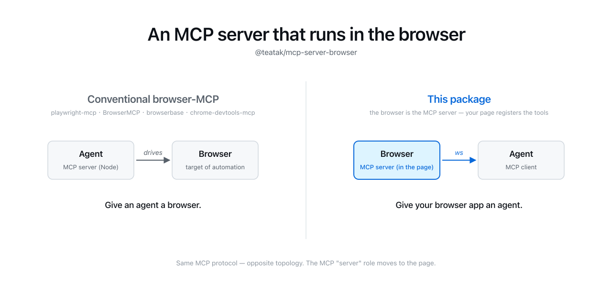

# @teatak/mcp-server-browser

<p align="center">
  
</p>

An [MCP (Model Context Protocol)][mcp] server that runs **in the browser**.

Register tools and prompts on a web page; expose them to a local MCP client
(such as an agent daemon or sidecar process) over WebSocket. The browser
acts as the **MCP server** — your tool handlers run client-side and the
agent calls into them.

[mcp]: https://modelcontextprotocol.io

## Why a "browser-side server"?

In the usual MCP topology, servers run as local processes and expose
filesystem / database / API tools. This package flips that: the browser
exposes capabilities to the agent. Useful when you want the agent to:

- Drive a UI you're rendering (a canvas, a chart, a form).
- Call into APIs that are only reachable from the user's browser session
  (authenticated SaaS, page-scoped APIs).
- Get human-in-the-loop confirmation through DOM affordances.

At the wire level the browser dials a WebSocket to the agent; at the MCP
protocol level the browser is the server (handles `tools/list`,
`tools/call`, `prompts/list`, etc.).

## How this differs from browser-automation MCP servers

If you've seen packages like [`@playwright/mcp`][playwright-mcp],
[`BrowserMCP/mcp`][browser-mcp], [`browserbase/mcp-server-browserbase`][browserbase],
or [`chrome-devtools-mcp`][chrome-devtools-mcp], those go in the **opposite
direction** from this one.

|                            | Browser-automation MCP servers          | `@teatak/mcp-server-browser`                                         |
| -------------------------- | --------------------------------------- | -------------------------------------------------------------------- |
| Where the MCP server runs  | A local Node process (or cloud)         | The browser page itself                                              |
| Who defines the tools      | The package author (fixed set)          | You — the page registers its own tools                               |
| Browser's role             | Target of automation (driven by agent)  | Active producer of capabilities                                      |
| Typical tools              | `navigate`, `click`, `screenshot`, …    | Anything your page can do — UI rendering, page-scoped APIs, etc.     |
| Bridge                     | Chrome extension / CDP / Playwright     | `new WebSocket(...)` from the page                                   |

Short version: those packages give **an agent a browser**. This package
lets **your browser app give an agent custom tools**.

The two patterns compose — you can use Playwright MCP to let an agent drive
a page **and** have the same page expose its own MCP server (via this
package) for higher-level domain operations.

[playwright-mcp]: https://github.com/microsoft/playwright-mcp
[browser-mcp]: https://github.com/BrowserMCP/mcp
[browserbase]: https://github.com/browserbase/mcp-server-browserbase
[chrome-devtools-mcp]: https://github.com/ChromeDevTools/chrome-devtools-mcp

## Install

```sh
npm install @teatak/mcp-server-browser
```

## Quick start

```ts
import { createServer } from "@teatak/mcp-server-browser";

const server = createServer({
  endpoint: "ws://127.0.0.1:9669/mcp/ws",
  serverInfo: { name: "my-page", version: "1.0.0" },
});

server.registerTool({
  name: "demo.echo",
  description: "Echo back whatever the caller passed.",
  inputSchema: {
    type: "object",
    properties: { text: { type: "string" } },
    required: ["text"],
  },
  handler: async ({ text }) => ({ ok: true, text }),
});

server.connect();
```

## The other side — a minimal Go agent

The snippet above is only half the picture. Here's the matching MCP
client side — a Go program that accepts the WebSocket from the browser
and drives it over plain JSON-RPC 2.0. No external MCP library required;
the only dependency is `gorilla/websocket`.

```go
package main

import (
	"encoding/json"
	"fmt"
	"log"
	"net/http"

	"github.com/gorilla/websocket"
)

type rpcMessage struct {
	JSONRPC string          `json:"jsonrpc"`
	ID      json.RawMessage `json:"id,omitempty"`
	Method  string          `json:"method,omitempty"`
	Params  json.RawMessage `json:"params,omitempty"`
	Result  json.RawMessage `json:"result,omitempty"`
	Error   *struct {
		Code    int    `json:"code"`
		Message string `json:"message"`
	} `json:"error,omitempty"`
}

// Single-flight roundtrip — sends one request and reads the next frame as
// its response. For concurrent calls, track pending requests by `id` in a
// sync.Map and dispatch from a dedicated read loop.
func roundtrip(conn *websocket.Conn, id int, method string, params any) (json.RawMessage, error) {
	p, _ := json.Marshal(params)
	idRaw, _ := json.Marshal(id)
	if err := conn.WriteJSON(rpcMessage{
		JSONRPC: "2.0", ID: idRaw, Method: method, Params: p,
	}); err != nil {
		return nil, err
	}
	var resp rpcMessage
	if err := conn.ReadJSON(&resp); err != nil {
		return nil, err
	}
	if resp.Error != nil {
		return nil, fmt.Errorf("rpc %d: %s", resp.Error.Code, resp.Error.Message)
	}
	return resp.Result, nil
}

var upgrader = websocket.Upgrader{
	// Tighten in production: pin Origin and validate a session token.
	CheckOrigin: func(r *http.Request) bool { return true },
}

func main() {
	http.HandleFunc("/mcp/ws", func(w http.ResponseWriter, r *http.Request) {
		conn, err := upgrader.Upgrade(w, r, nil)
		if err != nil {
			return
		}
		defer conn.Close()

		// 1. Handshake.
		if _, err := roundtrip(conn, 1, "initialize", map[string]any{
			"protocolVersion": "2025-03-26",
			"clientInfo":      map[string]any{"name": "demo-agent", "version": "0.1"},
			"capabilities":    map[string]any{},
		}); err != nil {
			log.Printf("initialize: %v", err)
			return
		}

		// 2. Discover what the page exposes.
		tools, err := roundtrip(conn, 2, "tools/list", struct{}{})
		if err != nil {
			log.Printf("tools/list: %v", err)
			return
		}
		log.Printf("browser exposes: %s", tools)

		// 3. Invoke one.
		result, err := roundtrip(conn, 3, "tools/call", map[string]any{
			"name":      "demo.echo",
			"arguments": map[string]any{"text": "hello from go"},
		})
		if err != nil {
			log.Printf("tools/call: %v", err)
			return
		}
		log.Printf("result: %s", result)
	})

	log.Println("listening on ws://127.0.0.1:9669/mcp/ws")
	log.Fatal(http.ListenAndServe("127.0.0.1:9669", nil))
}
```

Run this next to the Quick start snippet above: the page dials in, gets
`initialize`d, and has its `demo.echo` tool called once. From here a
real agent typically grows a pending-request map keyed by `id` for
concurrent calls, a hub holding multiple browser sessions (one per tab),
and a `notifications/tools/list_changed` handler so the tool set can be
hot-reloaded as the page registers new tools.

## Authentication

This package is **unopinionated about auth**. The browser's WebSocket
constructor only exposes two knobs (`url` and `protocols`); any auth scheme
ultimately rides on one of those. Instead of baking in a specific mechanism,
the library exposes a `createSocket` factory and lets you decide.

The factory is called on every (re)connect — perfect for short-lived tokens.

### No auth (default)

```ts
createServer({
  endpoint: "ws://127.0.0.1:9669/mcp/ws",
  serverInfo: { name: "demo", version: "1.0.0" },
});
```

### Bearer token in URL

```ts
createServer({
  endpoint: "ws://127.0.0.1:9669/mcp/ws",
  serverInfo: { name: "demo", version: "1.0.0" },
  createSocket: ({ endpoint }) =>
    new WebSocket(`${endpoint}?token=${encodeURIComponent(TOKEN)}`),
});
```

### Bearer token in `Sec-WebSocket-Protocol`

Avoids tokens leaking into logs / browser history.

```ts
createServer({
  endpoint: "ws://127.0.0.1:9669/mcp/ws",
  serverInfo: { name: "demo", version: "1.0.0" },
  createSocket: ({ endpoint }) =>
    new WebSocket(endpoint, ["mcp.v1", `bearer.${TOKEN}`]),
});
```

The MCP client side should validate the subprotocol on upgrade and echo the
chosen one back.

### Fresh token per connection

```ts
createServer({
  endpoint: "ws://127.0.0.1:9669/mcp/ws",
  serverInfo: { name: "demo", version: "1.0.0" },
  createSocket: async ({ endpoint, attempt }) => {
    const token = await fetch("/mcp/session-token").then((r) => r.text());
    return new WebSocket(endpoint, [`bearer.${token}`]);
  },
});
```

`attempt` is `0` on the first connect and increments on each reconnect, in
case you want to short-circuit retries after some bound.

### A note on threat model

Localhost WebSocket endpoints are **not** protected by the browser's
same-origin policy — any tab on the user's machine can dial `ws://127.0.0.1`.
For real deployments the MCP client side should pair token validation with
an `Origin` header allowlist.

## Entry points

| Import path                                      | What's there                                          |
| ------------------------------------------------ | ----------------------------------------------------- |
| `@teatak/mcp-server-browser`                     | High-level `createServer` API (recommended).          |
| `@teatak/mcp-server-browser/transport`           | Raw `WsTransport` class for bespoke MCP servers.      |
| `@teatak/mcp-server-browser/spec`                | Wire-level JSON-RPC / MCP types and constants.        |

## Prompts

In addition to tools, this package supports a lightweight `prompts` capability
— a chunk of guidance text that the MCP client should append to its LLM
system instruction. Compared to MCP's standard prompts, this variant is
deliberately simpler: no `arguments`, no `prompts/get` round-trip — content
is delivered inline in `prompts/list`.

```ts
server.registerPrompt({
  name: "ui-render-table.usage",
  description: "Constraints for the ui_render_table tool.",
  content: `When calling ui_render_table, only pass rows from real data. Never invent values.`,
});
```

## Status

Pre-1.0. API may evolve. Tested against MCP protocol version `2025-03-26`.

## License

MIT
